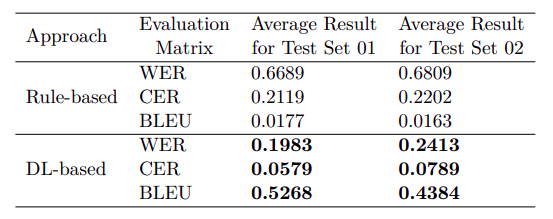

# Sinhala-Transliterator
This is the official codebase for the [paper][paper-url]. Here we introduce Transliteration Solutions for Sinhala Language which is extendable for other Languages as well. 

## Introduction
We introduce two Transliteration solutions for Sinhala Transliteration problem as our solution for the [Shared Task of IndoNLPWorkshop 2025](https://indonlp-workshop.github.io/IndoNLP-Workshop/sharedTask/).

## Our Approaches
We introduced and evaluated two approaches as our solution for the task.

### Rule-based Approach:
A rule-based solution for Sinhala Transliteration which the resources can be found in [rule-based-method/][rule-based-method-url] directory.

### Seq2Seq Modelling Approach:
A deep-learning-based Seq2seq modeling solution for Sinhala Transliteration which the resources can be found in [seq2seq-method/][seq2seq-method-url] directory. Our trained model is available on [huggingface][hf-model-url].

## Results
- Official Test sets: https://github.com/IndoNLP-Workshop/IndoNLP-2025-Shared-Task (we have cleaned and arranged the official test sets into both csv and txt formats which can be found in [test-sets/][test-sets-url] directory)
- Test set 1 consists of 10,000 datapoints with General Romanized Typing Patterns	and, Test set 2 consists of 5,000 datapoints with Adhoc Romanized Typing Patterns
- Following table shows the evaluation scores of our two approaches on the official test-sets

paper-url

## Publication
If you are willing to use this work, please be kind enough to cite the following [paper][paper-url]. Also don't hesitate to rate this repository if you find it useful.

```
@inproceedings{de-mel-etal-2025-sinhala,
    title = "{S}inhala Transliteration: A Comparative Analysis Between Rule-based and {S}eq2{S}eq Approaches",
    author = "De Mel, Yomal  and
      Wickramasinghe, Kasun  and
      de Silva, Nisansa  and
      Ranathunga, Surangika",
    editor = "Weerasinghe, Ruvan  and
      Anuradha, Isuri  and
      Sumanathilaka, Deshan",
    booktitle = "Proceedings of the First Workshop on Natural Language Processing for Indo-Aryan and Dravidian Languages",
    month = jan,
    year = "2025",
    address = "Abu Dhabi",
    publisher = "Association for Computational Linguistics",
    url = "https://aclanthology.org/2025.indonlp-1.19/",
    pages = "166--173",
    abstract = "Due to reasons of convenience and lack of tech literacy, transliteration (i.e., Romanizing native scripts instead of using localization tools) is eminently prevalent in the context of low-resource languages such as Sinhala, which have their own writing script. In this study, our focus is on Romanized Sinhala transliteration. We propose two methods to address this problem: Our baseline is a rule-based method, which is then compared against our second method where we approach the transliteration problem as a sequence-to-sequence task akin to the established Neural Machine Translation (NMT) task. For the latter, we propose a Transformer based Encode-Decoder solution. We witnessed that the Transformer-based method could grab many ad-hoc patterns within the Romanized scripts compared to the rule-based method."
}
```

<!-- MARKDOWN LINKS & IMAGES -->
<!--  [paper-url]: https://arxiv.org/abs/2501.00529 -->
[paper-url]: https://aclanthology.org/2025.indonlp-1.19/
[hf-model-url]: https://huggingface.co/kasunw/sinhala-transliterator
[rule-based-method-url]: https://github.com/kasunw22/Sinhala-Transliterator/tree/main/rule-based-method
[seq2seq-method-url]: https://github.com/kasunw22/Sinhala-Transliterator/tree/main/seq2seq-method
[test-sets-url]: https://github.com/kasunw22/Sinhala-Transliterator/tree/main/test-sets
